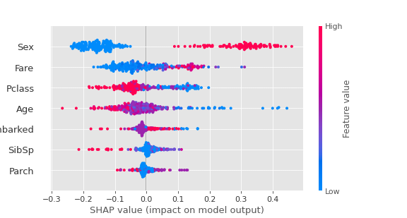
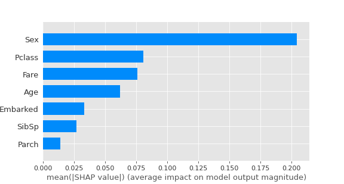

# SHAP (SHapley Additive exPlanations)
## _A notebook for SHAP in python_

SHAP (SHapley Additive exPlanations) is a game theoretic approach to explain the output of any machine learning model. It connects optimal credit allocation with local explanations using the classic Shapley values from game theory and their related extensions.

## Main Idea

The main idea of SHAP rests upon the following equation where it captures the average marginal contribution of a feature value (player) across all possible coalitions (society).

where n is the total number of players and the sum extends over all subsets S of N not containing player i. The formula can be interpreted as follows: imagine the coalition being formed one actor at a time, with each actor demanding their contribution  as a fair compensation, and then for each actor take the average of this contribution over the possible different permutations in which the coalition can be formed.

Reference: [Shapley Values](https://towardsdatascience.com/one-feature-attribution-method-to-supposedly-rule-them-all-shapley-values-f3e04534983d)

## Enviornment
The enviornment is as follows:
- python 3.6.x
- windows 10
- [scikit-learn](https://scikit-learn.org/stable/#)
- [shap](https://shap.readthedocs.io/en/latest/index.html#)

## Sample Dataset
The dataset used in this notebook is taken from the [Kaggle-titanic](https://www.kaggle.com/c/titanic) competition.
The main objective is to predict wheather a passenger will survive.

## SHAP analysis
Features Summary Plot

Features Summary Bar

Explained by Sex

Explained by Pclass

Explained by Age

